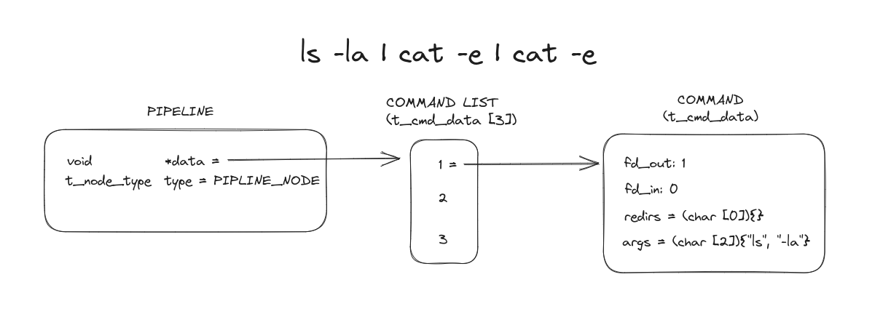
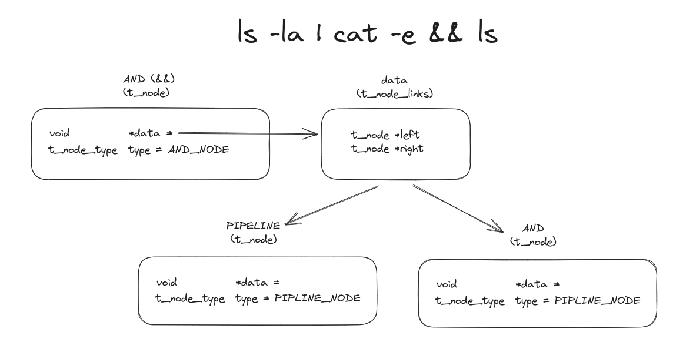

# Minishell

## Links




## Posix Rules to Know

### Expand

<details>
<summary> Word Expansions </summary>

#### Unspecified results

The '\$' character is used to introduce parameter expansion, command substitution, or arithmetic evaluation. If an unquoted '\$' is followed by a character that is not one of the following:
* A numeric character
* The name of one of the special parameters (see Special Parameters)
* A valid first character of a variable name
* A \<left-curly-bracket\> ( '\{' )
* A \<left-parenthesis\>

the result is unspecified.
</details>

<details>
<summary> Errors </summary>

ambiguous redirect

```bash
export a="file1 file2"
ls > $a
bash: $a: ambiguous redirect
```
```bash
export a=""
< $a cat
bash: $a: ambiguous redirect
```
</details>

## Valgrind flags

```
valgrind --suppressions=./readline.supp --leak-check=full --show-leak-kinds=all --track-fds=yes --trace-children=yes  ./minishell
```